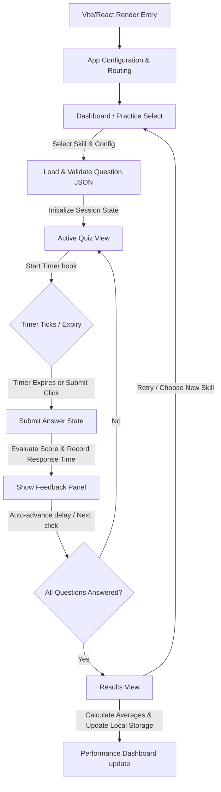

# Technical Writing Practice Platform (SkillDrill) - System Architecture

This document defines the high-level architecture, directory layout, design system, services, data models, state management, and validation strategy for the MVP of the Technical Writing Practice Platform (**SkillDrill**).

---

## 1. System Design Principles

- **Developer-First Aesthetics:** Sleek, GitHub/Linear-inspired dark/light monochrome UI with subtle blue accents. No gradients or illustrations.
- **Static-First Deployment:** High performance, SEO-friendly, zero-backend, zero-cost architecture designed for fast static hosting (e.g., GitHub Pages).
- **Separation of Concerns:** Business logic (timer, scoring, question validation) must be decoupled from UI rendering.
- **Strict Accessibility (WCAG 2.2 AA):** Fully keyboard navigable, visible focus states, and semantic HTML elements.
- **Future-Ready Extensibility:** Modular layout that easily plugs in future features (Supabase Auth, leaderboards, streaks, scenario challenges, and AI peer review) without rewriting core logic.

---

## 2. Technology Stack & Configuration

- **Frontend Core:** [React](https://react.dev/) + [Vite](https://vitejs.dev/) + [TypeScript](https://www.typescriptlang.org/) (Static Single Page Application).
- **Styling:** Vanilla CSS utilizing Custom Properties (CSS variables) for design tokens to support robust light/dark theming and avoid heavy external dependencies.
- **Build & Deployment:** Vite static export deployment configuration for GitHub Pages.
- **Testing:** Jest or Vitest for unit testing services, schemas, and state transitions.

---

## 3. Directory Structure

The codebase is organized into modules aligning with separation of concerns and features:

```text
c:\crm_sofs\SkillDrill\
├── public/
│   ├── favicon.ico
│   ├── manifest.json
│   └── questions/                 # Canonical Question Bank (Static JSONs)
│       ├── documentation-fundamentals/
│       ├── api-documentation/
│       ├── style-guides/
│       ├── docs-as-code/
│       ├── ai-for-technical-writers/
│       ├── content-strategy/
│       ├── professional-skills/
│       └── interview-preparation/
├── src/
│   ├── main.tsx                   # App Entry Point
│   ├── App.tsx                    # Root App & Routing Setup
│   ├── types/
│   │   └── index.ts               # Core Interfaces & Type Definitions
│   ├── styles/
│   │   ├── variables.css          # Design Tokens (CSS Variables)
│   │   ├── global.css             # Base styles & typography reset
│   │   ├── layout.css             # App shell & layout styling
│   │   └── components/            # Component-specific Vanilla CSS
│   │       ├── buttons.css
│   │       ├── cards.css
│   │       └── quiz.css
│   ├── components/
│   │   ├── layout/
│   │   │   ├── AppShell.tsx       # Standard grid layout wrapper
│   │   │   ├── TopNav.tsx         # Main header, logo, theme toggle
│   │   │   ├── PageHeader.tsx     # Section page headings
│   │   │   └── Footer.tsx         # Footer & links
│   │   ├── common/
│   │   │   ├── Button.tsx         # Custom buttons (Primary, Secondary, Ghost, Danger)
│   │   │   ├── Badge.tsx          # Pills for difficulty/tags
│   │   │   ├── Card.tsx           # Bordered cards
│   │   │   ├── Divider.tsx        # Subtle dividing lines
│   │   │   └── Modal.tsx          # Overlay modal dialogs
│   │   ├── dashboard/
│   │   │   ├── HeroBanner.tsx     # Tagline and CTA
│   │   │   ├── DashboardCard.tsx  # Interactive cards for paths
│   │   │   └── PerformanceCard.tsx# Recent performance graphs/stats
│   │   ├── practice/
│   │   │   ├── SkillCard.tsx      # Renders card for single competency
│   │   │   └── SkillGrid.tsx      # Multi-column grid of competencies
│   │   ├── quiz/
│   │   │   ├── QuizHeader.tsx     # Counter, Progress bar, Timer display
│   │   │   ├── CountdownTimer.tsx # Visual ticking timer with warning state
│   │   │   ├── QuestionCard.tsx   # Displays prompt and options
│   │   │   ├── AnswerOption.tsx   # Single selectable answer option
│   │   │   └── FeedbackPanel.tsx  # Detailed explanation, reference, and example
│   │   └── results/
│   │       ├── ScoreSummary.tsx   # Final score & accuracy percentages
│   │       ├── StatisticsCard.tsx # Performance metrics (e.g. average time)
│   │       └── IncorrectList.tsx  # Expandable list of missed questions
│   ├── services/
│   │   ├── questionRepository.ts  # Fetching and validating question banks
│   │   ├── quizSession.ts         # Pure functional state machine for quizzes
│   │   ├── localStorageService.ts # Accessing settings, theme, progress, scores
│   │   └── analyticsService.ts    # GA4 & Clarity wrapper tracking interface
│   ├── hooks/
│   │   ├── useQuiz.ts             # Hook linking UI elements to quiz state
│   │   ├── useTimer.ts            # Hook managing countdowns & tick events
│   │   └── useTheme.ts            # Dark/Light class switcher & toggle
│   └── utils/
│       ├── schemaValidator.ts     # Client-side JSON question validation
│       └── helpers.ts             # Randomization & time formats
```

---

## 4. Design Tokens & Styling (CSS Variables)

To implement the requested GitHub-inspired design, custom properties are defined in `src/styles/variables.css`:

```css
:root {
  /* Color Palette - Monochrome & Accents (Light Mode) */
  --bg-color: #ffffff;
  --surface-color: #f6f8fa;
  --surface-hover: #eaeef2;
  --border-color: #d0d7de;
  --border-hover: #8c959f;
  
  --text-primary: #24292f;
  --text-secondary: #57606a;
  --text-muted: #6e7781;
  
  /* Primary Action Accent */
  --accent-color: #0969da;
  --accent-hover: #0c57c4;
  --accent-focus: rgba(9, 105, 218, 0.15);
  
  /* Semantics */
  --success-color: #1a7f37;
  --success-bg: #dafbe1;
  --warning-color: #9a6700;
  --warning-bg: #fff8c5;
  --error-color: #cf222e;
  --error-bg: #ffebe9;
  --info-color: #0969da;
  --info-bg: #ddf4ff;

  /* Spacing Grid (8px Base) */
  --space-1: 4px;
  --space-2: 8px;
  --space-3: 12px;
  --space-4: 16px;
  --space-5: 24px;
  --space-6: 32px;
  --space-7: 48px;
  --space-8: 64px;

  /* Typography Scale */
  --font-family: 'Inter', system-ui, -apple-system, sans-serif;
  --font-size-display: 48px;
  --font-size-h1: 36px;
  --font-size-h2: 30px;
  --font-size-h3: 24px;
  --font-size-h4: 20px;
  --font-size-body-lg: 18px;
  --font-size-body: 16px;
  --font-size-body-sm: 14px;
  --font-size-caption: 12px;
  
  --line-height-heading: 1.2;
  --line-height-body: 1.6;

  /* Border Radii */
  --radius-sm: 4px;
  --radius-md: 6px;
  --radius-lg: 8px;
  --radius-xl: 12px;
  
  /* Elevation Shadows */
  --shadow-sm: 0 1px 2px rgba(31, 35, 40, 0.05);
  --shadow-md: 0 3px 6px rgba(140, 149, 159, 0.15);
  
  /* Motion & Animation */
  --duration-fast: 150ms;
  --duration-normal: 250ms;
  --easing-default: cubic-bezier(0.4, 0, 0.2, 1);
}

@media (prefers-color-scheme: dark) {
  :root[data-theme="system"] {
    /* Auto-switch configurations */
  }
}

/* Explicit Dark Theme Mapping */
:root[data-theme="dark"] {
  --bg-color: #0d1117;
  --surface-color: #161b22;
  --surface-hover: #21262d;
  --border-color: #30363d;
  --border-hover: #8b949e;
  
  --text-primary: #c9d1d9;
  --text-secondary: #8b949e;
  --text-muted: #484f58;
  
  --accent-color: #58a6ff;
  --accent-hover: #1f6feb;
  --accent-focus: rgba(88, 166, 255, 0.15);
  
  --success-color: #3fb950;
  --success-bg: rgba(46, 160, 67, 0.15);
  --warning-color: #d29922;
  --warning-bg: rgba(187, 128, 9, 0.15);
  --error-color: #f85149;
  --error-bg: rgba(248, 81, 73, 0.15);
  --info-color: #58a6ff;
  --info-bg: rgba(56, 139, 253, 0.15);
  
  --shadow-sm: 0 1px 0 rgba(1, 4, 9, 0.85);
  --shadow-md: 0 8px 24px rgba(1, 4, 9, 0.85);
}
```

---

## 5. Core Services Architecture

### A. Question Repository (`questionRepository.ts`)
Loads, filters, and prepares questions from local JSON files.
- **Caching:** In-memory caching of loaded skill-specific files to ensure `< 100ms` transition speed.
- **Randomization:** Employs the *Fisher-Yates Shuffle* for question order. Retains the default order of options to simplify maintenance.
- **Methods:**
  - `loadQuestionsForSkill(skill: SkillCategory): Promise<Question[]>`
  - `selectQuizQuestions(questions: Question[], limit: number, difficulty: Difficulty): Question[]`

### B. Quiz Session Engine (`quizSession.ts`)
Pure functional state machine managing the progress of an active quiz.
```typescript
export interface QuizSessionState {
  config: QuizConfig;
  questions: Question[];
  currentIndex: number;
  selectedAnswers: Record<number, number>; // index -> selected option index
  responseTimes: Record<number, number>;   // index -> response time in ms
  timerValues: Record<number, number>;     // index -> remaining time on submit
  isSubmitted: boolean;                    // true if current question has feedback shown
  completed: boolean;
  score: number;
}

export const initialSession = (config: QuizConfig, questions: Question[]): QuizSessionState => ({
  config,
  questions,
  currentIndex: 0,
  selectedAnswers: {},
  responseTimes: {},
  timerValues: {},
  isSubmitted: false,
  completed: false,
  score: 0
});

// Transition reducers
export const submitAnswer = (state: QuizSessionState, answerIndex: number, timeSpentMs: number): QuizSessionState => { ... }
export const nextQuestion = (state: QuizSessionState): QuizSessionState => { ... }
```

### C. Local Storage Adapter (`localStorageService.ts`)
Manages state persistence for progress records and user preferences.
- **Key Schemas:**
  - `skilldrill_theme`: `'light' | 'dark'`
  - `skilldrill_settings`: `{ timerDuration: 15 | 30 | 45 | 60, defaultQuestionCount: 5 | 10 | 20, defaultDifficulty: Difficulty }`
  - `skilldrill_history`: Array of records: `{ date: string, skill: string, score: number, total: number, accuracy: number, avgTimeMs: number }`

### D. Analytics Tracker (`analyticsService.ts`)
Decouples tracking calls and handles fail-safes (errors in analytics must not interrupt the user experience).
- **Methods:**
  - `trackEvent(name: string, params?: Record<string, any>): void` (safely tests if `window.gtag` is present)
  - Predefined wrappers: `trackQuizStart()`, `trackAnswerSubmitted()`, `trackQuizCompleted()`

---

## 6. Question Content Model & Schemas

To comply with the `15-Question-JSON-Schema.md` standard, all question files are validated client-side and via test scripts.

```typescript
export type SkillCategory =
  | 'documentation-fundamentals'
  | 'api-documentation'
  | 'style-guides'
  | 'docs-as-code'
  | 'ai-for-technical-writers'
  | 'content-strategy'
  | 'professional-skills'
  | 'interview-preparation';

export type Difficulty = 'easy' | 'medium' | 'hard' | 'mixed';

export interface Reference {
  title: string;
  url: string;
}

export interface Question {
  schemaVersion: string;
  id: string;
  skill: SkillCategory;
  difficulty: 'easy' | 'medium' | 'hard';
  type: 'multiple-choice';
  tags: string[];
  question: string;
  options: string[];
  correctAnswer: number; // 0-based index
  explanation: string;
  reference: Reference;
  realWorldExample: string;
  estimatedTime: number; // in seconds
  status: 'draft' | 'review' | 'published' | 'archived';
}
```

---

## 7. State Management Flow



---

## 8. Extension Points for Future Phases

The architecture accommodates Phase 2+ features with minimal modifications:

1. **Authentication & Sync (Supabase):**
   - Extend `localStorageService.ts` to coordinate with a database client (`supabaseClient`). If user is signed in, sync history records; otherwise, use browser Local Storage.
2. **Behavioral & Scenario Assessments:**
   - Extend `Question` type with optional `scenario` or `matrix` parameters.
   - Expand `quizSession.ts` state with complex scoring algorithms for multi-weight response models (e.g. "Most Like Me" / "Least Like Me").
3. **AI Review Engine:**
   - Place a dedicated page handler that invokes remote API endpoints, accepting raw documentation inputs and feeding feedback to a specialized `ReviewPanel.tsx` component.

---

## 9. Verification & Quality Gates Plan

To ensure the codebase operates reliably before deployment, the following verification checklist must be executed:

- **JSON Lint & Validate:** Running a custom Node script (`validate-schemas.js`) to assert that all files in `public/questions/**/*.json` pass the standard draft-2020-12 schema validation.
- **Unit Tests:** Execute test suites asserting:
  - Correct shuffling behaviour (no duplicates).
  - Exact timer expiry triggering incorrect marks.
  - Proper local storage reads and fallback limits.
- **Visual Auditing:** Validating desktop (1280px+) vs. mobile mobile (360px+) rendering using Chrome DevTools emulator to satisfy design consistency.
- **Contrast Check:** Verifying contrast ratio limits (4.5:1 minimum) using automated tools.
